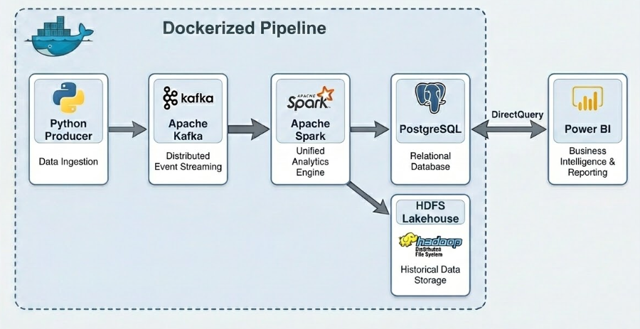
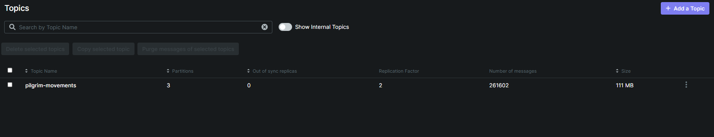
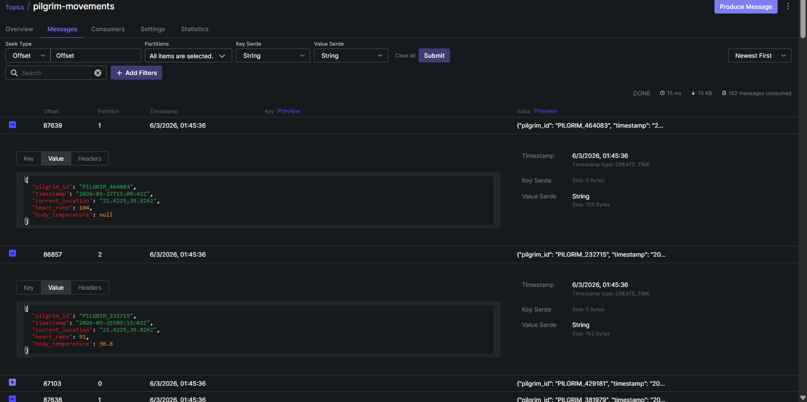
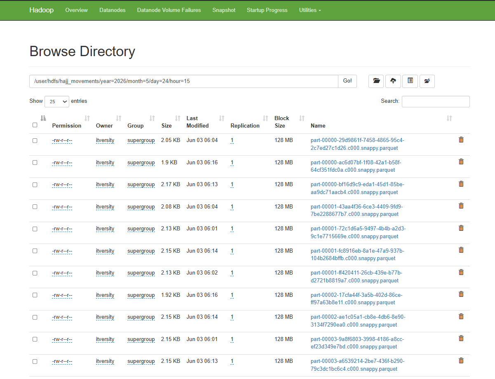
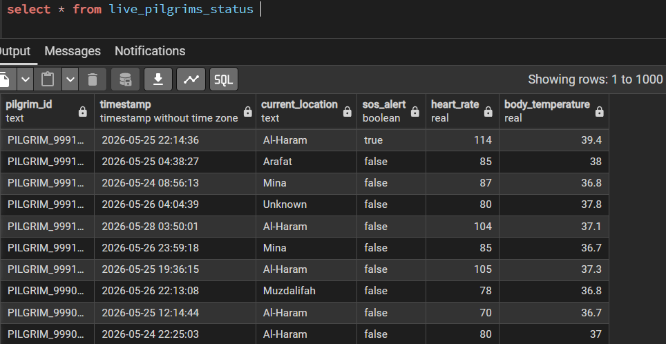
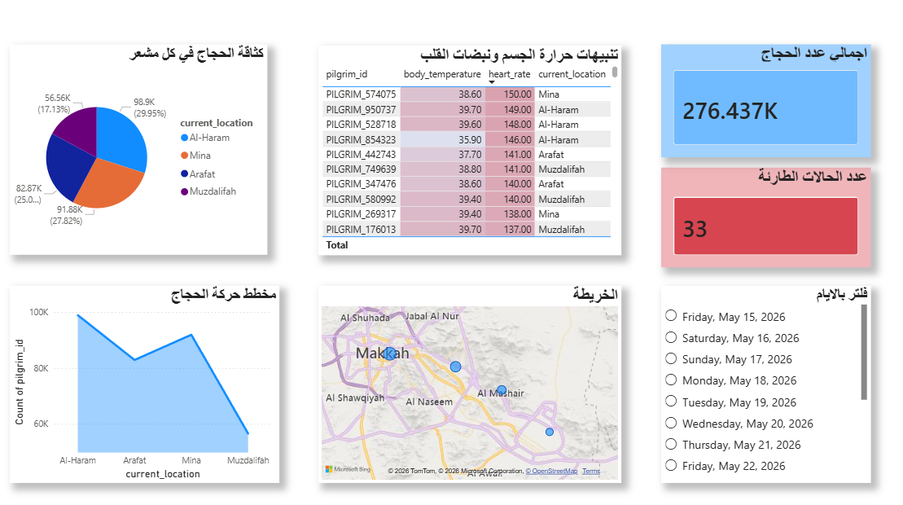

# 🕋 Hajj Pilgrim Health & Monitoring Pipeline

A fault-tolerant real-time health monitoring platform designed for Hajj pilgrims. The system leverages distributed streaming technologies to ingest, process, analyze, and visualize health telemetry data while providing near real-time emergency (SOS) detection.

---

## 📌 Executive Summary

Managing the health and safety of millions of pilgrims during Hajj requires continuous monitoring and rapid response capabilities. This project simulates a large-scale IoT healthcare monitoring system capable of:

- Collecting pilgrim telemetry data in real time
- Detecting emergency (SOS) situations instantly
- Processing streaming events at scale
- Storing historical records for analytics and auditing
- Delivering near-real-time operational dashboards

The architecture follows a **Lambda-style Data Architecture**, combining real-time stream processing with long-term analytical storage.

---

# 🏗️ System Architecture

The platform consists of five major layers:

1. IoT Data Simulation
2. Kafka Streaming Layer
3. Spark Processing Layer
4. Storage Layer (HDFS + PostgreSQL)
5. Visualization Layer (Power BI)

## Architecture Diagram



---

# ⚙️ Technology Stack

| Component | Technology | Role |
|------------|------------|------------|
| Producer | Python | Simulated IoT telemetry generation |
| Message Broker | Apache Kafka | Distributed event streaming |
| Processing Engine | Apache Spark Structured Streaming | Real-time transformations and analytics |
| Data Lake | HDFS + Parquet | Historical storage |
| Operational Database | PostgreSQL | Dashboard serving layer |
| Visualization | Power BI | Monitoring and analytics |
| Infrastructure | Docker Compose | Service orchestration |

---

# 🔄 End-to-End Data Flow

```text
Python IoT Simulator
        │
        ▼
Apache Kafka
        │
        ▼
Spark Structured Streaming
        │
 ┌──────┴──────┐
 ▼             ▼

HDFS       PostgreSQL
(Parquet)   (Live Data)
                │
          ┌─────┘ 
          ▼

      Power BI
```

---

# 📡 Data Ingestion Layer (Apache Kafka)

Apache Kafka serves as the backbone of the streaming architecture, ensuring scalable and fault-tolerant event ingestion.

## Kafka Configuration

| Setting | Value |
|----------|---------|
| Topic | `pilgrim-movements` |
| Partitions | `3` |
| Replication Factor | `2` |
| Retention | `24 Hours` |

## Why Kafka?

- High-throughput event streaming
- Fault tolerance through replication
- Horizontal scalability
- Decoupled producer-consumer architecture
- Reliable buffering during downstream outages

### Kafka Topic Distribution



### Sample Kafka Messages



---

# 🔥 Stream Processing Layer (Apache Spark)

Apache Spark Structured Streaming acts as the intelligence layer of the platform.

The streaming application continuously consumes data from Kafka and applies several transformations before persisting the results.

## Processing Workflow

### 1. Data Quality Handling

Missing values are automatically imputed using baseline medical values.

| Metric | Default Value |
|----------|-------------|
| Heart Rate | 80 BPM |
| Temperature | 37.0 °C |

### 2. Data Enrichment

Custom Spark UDFs are used to:

- Map telemetry to logical locations
- Classify movement patterns
- Generate dynamic SOS alerts
- Enrich records with operational metadata

### 3. Deduplication

Duplicate records are removed using a composite key:

```python
pilgrim_id + timestamp
```

This ensures row-level uniqueness and prevents duplicate alerts.

### 4. Checkpointing

Spark checkpoints are stored in HDFS to support:

- Exactly-once processing semantics
- Stateful recovery
- Failure resilience
- Stream restart capability

---

# 🚨 SOS Detection Engine

One of the primary objectives of the system is early emergency detection.

The Spark pipeline continuously evaluates incoming telemetry and generates SOS alerts whenever abnormal health conditions are detected.

## Example Detection Rules

- Critical heart rate levels
- Dangerous body temperature readings
- Device-generated emergency signals
- Abnormal movement behavior

Detected SOS events become immediately available in:

- PostgreSQL
- Power BI Dashboards
- Operational Monitoring Systems

---

# 💾 Storage Layer

The platform follows a dual-storage strategy optimized for both operational workloads and long-term analytics.

---

## Historical Storage (HDFS + Parquet)

Processed records are persisted as Parquet files in HDFS.

### Benefits

- Columnar storage format
- Compression efficiency
- Schema evolution support
- Cost-effective long-term storage

### Partitioning Strategy

Data is partitioned by time hierarchy:

```text
/year=
    /month=
        /day=
            /hour=
```

This significantly reduces scan costs during analytical workloads.

### HDFS Storage Structure



---

## Operational Storage (PostgreSQL)

PostgreSQL serves as the low-latency serving layer for operational dashboards.

### Live Table

```sql
live_pilgrims_status
```

### Stored Information

- Current pilgrim status
- Latest health metrics
- Current location
- SOS indicators
- Last update timestamp

### PostgreSQL Sample Records



---

# 📊 Visualization Layer (Power BI)

Power BI provides near real-time monitoring capabilities through DirectQuery integration with PostgreSQL.

Unlike traditional ETL dashboards, DirectQuery allows the dashboard to retrieve fresh operational data directly from the database.

## Dashboard Features

- Real-time health monitoring
- SOS alert tracking
- Pilgrim status overview
- Operational KPIs
- Geographical insights
- Live telemetry visualization

---

## Dashboard Overview



---

# 🛡️ Reliability & Fault Tolerance

The platform is designed with resiliency as a core requirement.

## Kafka

- Replication Factor = 2
- Automatic broker failover
- Event retention for recovery

## Spark

- Stateful checkpointing
- Exactly-once processing guarantees
- Automatic stream recovery

## HDFS

- Distributed storage architecture
- Data redundancy and durability

## PostgreSQL

- Optimized operational querying
- Reliable dashboard serving layer

---

# 🎯 Key Learning Outcomes

This project demonstrates practical implementation of:

- Apache Kafka
- Apache Spark Structured Streaming
- HDFS Data Lake Architecture
- PostgreSQL Operational Databases
- Power BI DirectQuery
- Docker-Based Distributed Systems
- Real-Time Event Processing
- Fault-Tolerant Data Engineering Pipelines

---

# 🚀 Future Enhancements

- **Medallion Architecture (Bronze, Silver, Gold)**  
  Organize data into layers to improve data quality, governance, and analytical readiness.

- **ClickHouse Integration**  
  Replace or complement PostgreSQL for high-performance real-time analytics and large-scale dashboard workloads.

- **Real GPS Device Integration**  
  Connect actual tracking devices instead of simulated data.

- **Machine Learning Anomaly Detection**  
  Detect abnormal health conditions proactively instead of relying only on fixed thresholds.

- **Predictive Health Risk Scoring**  
  Estimate potential health risks before emergencies occur.

- **Automated Alerts**  
  Send SOS notifications through SMS, email, or mobile applications.

- **Delta Lake Adoption**  
  Add ACID transactions, data versioning, and improved reliability to the data lake.

- **Kubernetes Deployment**  
  Enable automatic scaling, self-healing, and high availability.

- **Geospatial Analytics (Apache Sedona)**  
  Analyze crowd movement, pilgrim density, and location-based incidents.

- **Observability & Monitoring**  
  Integrate Grafana dashboards for infrastructure and pipeline monitoring.
